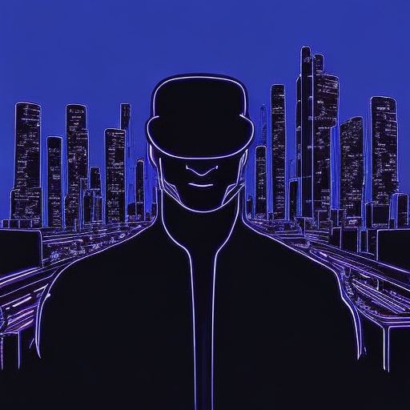

# Greetings, fellow Earthlings! 👽

## Intergalactic Introduction

🚀 Buckle up! I'm [Abul Faris], a code-slinging extraterrestrial on a mission to bring cosmic creativity and laughter to your universe. With my trusty starship (laptop) and an arsenal of quirky coding spells, I'm here to sprinkle stardust on your projects and warp-speed your development process.

## Skills from the Cosmos 🌌

- Hyperspace Python maneuvers
- Light-speed problem-solving
- Telepathic debugging (I can sense bugs before they even manifest!)

## Projects Across Galaxies 🌠

1. **[Project X]:** Created an AI-powered translator for decoding alien languages - no more need for universal translators!
2. **[Project Y]:** Built a time-traveling app that lets you preview your code in different eras - witness the evolution of technology firsthand!
3. **[Project Z]:** Crafted a mind-reading algorithm to predict the next meme trend - stay ahead of the meme game!

## Get in Touch Across Dimensions 🌌

[📫 **Holo-Email:**](mailto:mails@abulfaris.inn) Drop me a message using advanced quantum entanglement technology - no delays, guaranteed!
[💫 **Interstellar LinkedIn:**](https://linkedin.com) Connect with me on the digital wormhole of professional networking - let's explore new frontiers together!
[🚀 **Intergalactic Portfolio:**](https://abulfaris.in) Blast off to my personal website and discover more extraterrestrial creations - mind the anti-gravity fields!

> "It's not a bug, it's an unidentified feature from a parallel universe." - Unknown

**Note:** I occasionally teleport to other dimensions to attend intergalactic coding conferences, so my response time might be affected. Thank you for your understanding!
